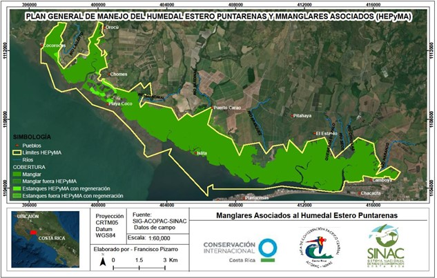
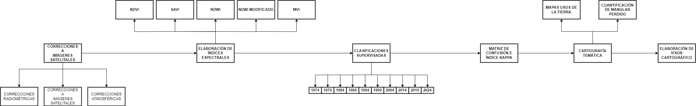

# ANÁLISIS MULTITEMPORAL DE LA DINÁMICA DE USOS DE LA TIERRA EN EL MANGLAR DE PUNTARENAS MEDIANTE LA TELEDETECCIÓN PARA EL PERÍODO 1974-2023

## Estudiante: Geancarlo Meléndez Salazar
## Carné: A63501

### INTRODUCCIÓN

La presente investigación pretende realizar un análisis multitemporal referente a dinámica de los usos de la tierra en el manglar de Puntarenas a lo largo de 50 años haciendo uso de la teledetección, específicamente mediante el uso de imágenes satelitales, analizando 1 imagen por cada 5 años. Aprovechando los insumos de los sensores Landsat 1 (imagen 1974), Landsat 5 (imágenes 1979, 1984, 1989 y 1994), Landsat 7 (imagen 1999, 2004 y 2009), Landsat 8 (2014) y Sentinel 2 (imágenes 2019 y 2024). Donde se aplicará una serie de índices espectrales (NDVI, SAVI, NDWI, NDWI Modificado y MVI) que permitirá discriminar los usos de la tierra existentes para cada imagen, obteniendo de esta forma la identificación del bosque de manglar.

Para lograrlo, se realizará una clasificación supervisada en el que se podrá obtener las distintas clasificaciones de usos de la tierra, que serán comparadas con sus firmas espectrales, y respaldadas por verificaciones en el campo ubicando algunos de los sitios encontrados en las clasificaciones. El procesamiento de las imágenes se realizará en el módulo Semi-Automatic Classification (SCP) del software libre QGIS. Se espera obtener de estos procesos una serie de imágenes con distintas dinámicas antrópicas en el que se podrá observar mediante los cambios de los usos de la tierra en el área de estudio, la transformación de los límites en el manglar de Puntarenas (principalmente en su margen norte) y con ello, vectorizar los resultados y cuantificar la pérdida de área que ha tenido este bosque a lo largo de medio siglo.

Finalmente, es importante validar los resultados mediante una matriz de confusión que derive el índice estadístico kappa para conocer el grado de confiabilidad de los datos, y poder dar certeza que los resultados obtenidos, representan lo que en verdad acontece en la realidad física. Concluyendo de esta forma con 10 mapas, que representarán la evolución histórica del manglar de Puntarenas durante 50 años, definiendo si este, a lo largo de los años ha reducido su área, y así cuantificar. De esta forma se podrá no solo obtener un mapa de pérdida total de área, sino que será posible concluir, en cuál lustro ha sido la que el manglar de Puntarenas ha sufrido mayor afectación.

Dentro de los resultados esperados se encuentra, los mapas de uso de suelo para el sector del manglar de Puntarenas para el período 1974, 1979, 1984, 1989, 1994, 1999, 2004, 2009, 2014, 2019 y 2024; derivado de la cartografía obtenida se cuantificará las áreas de manglar reducidas, y se identificará el nuevo límite del manglar, según la transformación sufrida en cada lustro. Además, se pretende facilitar tanto al SINAC como a la Municipalidad de Puntarenas, una propuesta de ajuste a la delimitación del área protegida Humedal Estero Puntarenas y Manglares asociados en el Decreto. N. 29277-. MINAE del 11 de enero del 2001.

Como último resultado esperado se encuentra, mediante un visor cartográfico, visualizar los distintos escenarios respecto a la modificación del manglar de Puntarenas, utilizando herramientas tecnológicas SIG como mapas interactivos de las distintas períodos analizados, y alguna otra información geoespacial que sea interactiva y permita no solo la consulta de información, sino que promueva la interacción de los usuarios con los resultados obtenidos, además de colocar algunos otros datos claves como por ejemplo, su equivalente en pérdidas respecto a la huella de carbono, y demás aspectos ecológicos generales, que sean posible cuantificar a raíz de los resultados obtenidos de esta investigación, que permita a este portal web, ser no solo visualizador de contenido académico, sino que también se pueda utilizar como un insumo de aprendizaje y concientización hacia la sociedad civil.

### DELIMITACIÓN

La delimitación espacial comprende la señalada por el Plan General de Manejo del Humedal Estero Puntarenas y Manglares Asociados (HEPyMA), con el objeto de determinar los cambios en el uso de la tierra del área silvestre protegida. En cuanto a la escala temporal, corresponde a un período de 50 años, para valorar el grado de incidencia que podría tener los factores antrópicos en la degradación del manglar y basados en que, considerando un periodo de tiempo mayor, no se cuentan con insumos satelitales para analizar imágenes anteriores.

*Figura 1. Ubicación del área de estudio. Fuente: SINAC, 2018.* 
Disponible en (chrome-extension://efaidnbmnnnibpcajpcglclefindmkaj/https://www.sinac.go.cr/ES/planmanejo/Plan%20Manejo%20ACOPAC/Humedal%20Estero%20Puntarenas%20y%20Manglares%20Asociados%20(2018).pdf)

### PROBLEMA

 Las dinámicas socioeconómicas desarrolladas bajo el contexto de los manglares, motivan a investigar posibles cambios alrededor de ellos, específicamente en cuanto a pérdidas de área ya que el crecimiento poblacional en las cercanías de este ecosistema (*Martínez, 2022*), sumado a desarrollos agropecuarios entre los que destacan los cultivos de caña de azúcar y la cría de camarones en piletas donde estas actividades no solo transforman el uso actual, sino que a lo largo de los años han transformado la red hídrica de la zona, causante principal de la transformación del manglar (*SINAC, 2019*).
Dentro de los daños ecológicos que se pueden mencionar se encuentran la pérdida de bosques de manglar lo que incide directamente la afectación de especies migratorias (aves), residentes (cocodrilos) y comerciales (bivalvos), que no solo genera un daño ambiental por sí mismo, sino que afecta la economía local deteriorando un hábitat de gran atractivo turístico, generador de empleo y fuentes económicas (*Álvarez, 2022*), además que por el grado de afectación en la acumulación de suelos distintos a los que originaron a los manglares, debido a la actividad agrícola en el área de estudio, es posible que este ya nunca se pueda volver a regenerar en algunas zonas, sin olvidar lo que esto significa en pérdida de la huella de carbono (*Cifuentes, M., Brenes, C., Manrow, M., & Torres, D. 2014*).

Además, los procesos de deforestación en la zona mencionada aceleran la sedimentación asociada lo que disminuye el canal de navegación entre el sector del estero y la ciudad de Puntarenas, siendo este un elemento que a futuro generará problemas de transporte entre la flotilla pesquera de los distritos Chacarita y Puntarenas en el cantón central homónimo (*Blanco, 2022*). Sin olvidar, que los procesos de acumulación sedimentaria están transformando la morfología costera (*Braga, 2015*) y el caso de la ciudad de Puntarenas no es la excepción, en donde se logran observar sectores aledaños a los atracaderos de los ferrys (sector del faro), la creación de nuevas playas por ausencia de un dragado periódico. 

### JUSTIFICACIÓN

El uso de la teledetección a lo largo de los años se ha convertido en una herramienta de mucha utilidad en la clasificación de usos de la tierra y por consiguiente su cuantificación (*Guadalupe, 2021*), por lo que, para este análisis se pretende aprovechar su potencialidad para cuantificar la cantidad de hectáreas perdidas a lo largo de todos estos años a causa de procesos invasivos que tienen que ver con aspectos económicos y sociales como la agricultura, la camaricultura, las salineras, y los asentamientos humanos (*Cifuentes, M., Brenes, C., Manrow, M., & Torres, D. 2014*). El evidenciar las transformaciones en el manglar, permitirá hacer un llamado a las autoridades encargadas para buscar alternativas que permitan el desarrollo económico y social sin crear mayores impactos en este ecosistema (*López, 2021*).

Pese al aporte a nivel de legislación mediante la creación de instrumentos como el Plan General de Manejo de los ecosistemas de Humedal entre Paquera, Puntarenas y Pochote, Política Nacional de Humedales, Plan General de Manejo del Humedal Estero Puntarenas y Manglares asociados (*SINAC, 2019*), y demás documentación legal que fomenta la conservación de estos ecosistemas, lo cierto del caso es que aunque se podría decir que las afectaciones han disminuido, aún persiste, por lo que evidenciarlas y cuantificarlas se vuelve necesario para que sirvan como insumos para la toma de decisiones en nuevas estrategias de conservación. 

### OBJETIVOS

#### OBJETIVO GENERAL
Determinar mediante la teledetección la dinámica de los usos de la tierra en el manglar de Puntarenas ocasionada por los procesos antrópicos para el período 1974-2024.

#### OBJETIVOS ESPECÍFICOS
- 1- Elaborar mapas de usos de la tierra en el manglar de Puntarenas cada 5 años durante el período de 1974-2024.

- 2- Mapear la cantidad de área perdida de manglar a lo largo de 50 años señalando cuales son los mayores períodos de afectación.

- 3- Implementar un visor cartográfico que muestre el proceso de transformación de este ecosistema durante 5 décadas.

### METODOLOGÍA

El trabajo se concentrará en el análisis de la dinámica en los usos de la tierra del manglar en el área silvestre protegida por el SINAC, según *Decreto. N. 29277*-. MINAE del 11 de enero del 2001, en el que se trabajará con imágenes Lansat 1, 5, 7 y 8, además de Sentinel 2, durante un período de 50 años, en el que cada 5 años se realizará una serie de procesos a cada imagen elegida, para concluir con el clasificación supervisada de 10 imágenes en total. 
*Torres (2022)* diseñó una metodología para el mapeo de la concentración del manglar a partir de imágenes satelitales en el que mediante la aplicación del análisis de una serie de índices espectrales que posteriormente validó mediante la matriz de confusión y el índice estadístico Kappa obtuvo resultados muy prometedores. 
A continuación, se describe los procesos que se utilizará para el desarrollo de esta metodología.

índice de vegetación de diferencia normalizada (NDVI)
Es de los índices más utilizados y sirve para discriminar la vegetación de otro tipo de cobertura (Manrique, 1999), en este caso se utilizará para estimar la cantidad y calidad de los bosques de manglar *(Rueda et al. 2015)*.

Índice de vegetación ajustado al suelo (SAVI)
Este índice permite aislar la información que aporta la vegetación, de la que procede del suelo que está bajo ella. Al usar este índice, dos coberturas vegetales de igual actividad fotosintética, pero sobre suelos muy diferentes, aparecerán con igual (o muy similar) índice SAVI, a diferencia de lo que puede suceder en el NDVI clásico *(Muñoz, 2013)*.

Índice de agua de diferencia normalizada (NDWI)  
Es un índice de vegetación identificado por las siglas del nombre en inglés (Normal Difference Water Index), la cual se ve afectada por la estructura interna de la hoja y el contenido de materia seca de la hoja, pero no por contenido de agua, Este índice es sensible a los cambios en el contenido de agua en el dosel de la vegetación *(Villatoro, 2021)*.

Índice de Agua de Diferencia Normalizada Modificado (MNDWI)
El potencial de este índice es que logra la discriminación de la cobertura de agua a partir del análisis del comportamiento espectral que ésta describe. Este producto permite aislar los cuerpos de agua de las demás coberturas y es, además, uno de los índices menos sensibles a la influencia de la vegetación o a la presencia de material en suspensión *(Da Silva, C. Insaurralde, J y Cardozo, O. 2014)*.

Índice de Vegetación de Manglar MVI
El índice MVI combina las bandas del visible e infrarrojo para medir la probabilidad de que un píxel de la imagen sea un manglar al extraer la información de verdor y la humedad de las bandas verde, NIR y SWIR1 *(Baloloy et al., 2020 en Torres, 2022)*.

Clasificación supervisada
La clasificación semiautomática o clasificación supervisada es un método para procesar imágenes de modo que permita identificar elementos tangibles en una imagen mediante firmas espectrales; y sostiene que hay varios tipos de algoritmos para clasificar una imagen, de manera que se pueda generar un mapa temático de la cobertura del suelo. Así mismo, para procesar imágenes y realizar análisis espacial con Sistema de Información Geográfica (SIG) es necesario el uso de un software específico, tal como el Semi-Automatic Classification Plugin (SCP) de QGIS *(Congedo, 2021 en Torres, 2022)*.
Dentro de los parámetros que *Torres (2022)* utiliza para la operación del Módulo SCP es el de máxima probabilidad para las clases relacionadas con el teorema de Bayes, en ello evalúa si un píxel corresponde a una clase de cobertura terrestre. Para la aplicación de este algoritmo se requiere una cantidad adecuada de píxeles por área de entrenamiento, facilitando el cálculo de la matriz de covarianza *(Congedo, 2021 en Torres, 2022)*. La función discriminante se calcula para cada píxel como:

En cuanto al algoritmo de mínima distancia, (Congedo en 2021 en Torres 2022), describe que este calcula la distancia Euclídea a través de las firmas espectrales de los píxeles de la imagen y las del área de entrenamiento y está definida mediante la ecuación:

Así mismo, el algoritmo de mapeo del ángulo espectral utiliza las firmas espectrales de los píxeles de la imagen y las de las áreas de entrenamiento, para el cálculo del ángulo espectral mediante la ecuación.

Matriz de confusión e índice kapa
También llamada matriz de error o tabla de contingencia y sirve para validar las clasificaciones basadas en una cantidad *“n”* de clases realizadas en una imagen satelital, con la realidad física descrita en el terreno, de esta forma minimiza errores por omisión (creados por el usuario) o por comisión (datos en el producto). Además, también se puede aplicar índice estadístico Kappa, el cual permite evidenciar la confianza de una clasificación además de la articulación entre las diferentes clases. Incluso, permite cuantificar la exactitud de la clasificación indicando la correlación entre el mapa obtenido y la información real del terreno, obteniendo de forma aleatoria la contribución. Este índice lo define la ecuación. En palabras sencillas, es aplicar un control de calidad a los productos generados por las clasificaciones.

### DIAGRAMA METODOLÓGICO

Figura 2. Diagrama de metodología de tesis. Fuente: *Elaboración propia basado en metodología de Torres (2022)*

### BIBLIOGRAFÍA

-	Álvarez Torres, B. (2022). El manglar como elemento de resiliencia sistémica en la comunidad de Puerto San Carlos, Baja California Sur. Un análisis de microescala. Tesis para optar por el grado de Maestría en Ciencias, uso Manejo y Preservación de los recursos naturales. Centro de Investigaciones Biológicas del Noroeste, SC. California, Estados Unidos.

-	Blanco Manley, Benjamín (2022). Destrucción de manglares deja a Puntarenas sin su mejor escudo contra el cambio climático. Blog de información Punto y Aparte. Disponible en (https://www.puntoyaparte-ca.com/destruccion-de-manglares-deja-a-puntarenas-sin-su-mejor-escudo-contra-el-cambio-climatico/). Consultado el 05/05/23

-	Braga Rocha, U. (2015). El cambio en la morfología costera, los problemas y recomendaciones para una gestión integrada en Playa Azul, distrito de Tárcoles, Costa Rica. Tesis (maestría académica en gestión integrada de áreas costeras tropicales) --Universidad de Costa Rica. Sistema de Estudios de Posgrado.

-	Cifuentes, M., Brenes, C., Manrow, M., & Torres, D. (2014). Dinámica de uso de la Tierra y Potencial de Mitigación de los Manglares del Golfo de Nicoya. Conservación Internacional: San José, Costa Rica.

-	Da Silva, C. J., Insaurralde, J. A., & Cardozo, O. D. (2014). Cartografía de coberturas del suelo mediante sensores remotos, de la ciudad de Resistencia. Revista Geográfica Digital. IGUNNE. Facultad de Humanidades. UNNE. Argentina (2013).

-	Guadalupe, A. O. B. (2021). Análisis multitemporal del cambio de cobertura vegetal y usos del suelo mediante herramientas SIG y Teledetección en la Reserva Ecológica Mache Chindul (REMACH), 1996-2019 (Doctoral dissertation, Ecuador-PUCESE-Escuela de Gestión Ambiental).

-	López Soler, S. (2021). Desplazamiento forzado y manglar en el Pacífico colombiano (Tumaco-Nariño) una valoración integral de la biodiversidad. Trabajo de Grado en la Modalidad de Tesis para optar al título de Administrador Ambiental. Disponible en: http://hdl.handle.net/11349/25990. Consultado el 5/5/23

-	Manrique, E. G. (1999). Índice de vegetación. Aplicación del NDVI. En TELEDETECCIÓN. Avances y Aplicaciones. VIII Congreso Nacional de Teledetección. Albacete, España (pp. 217-219).

-	Martínez Martínez, M. A. (2022). Caracterización del cambio global en los trópicos entre 1992 y 2015. Tesis para optar al grado y título de Maestría Académica en Geografía. San José, Costa Rica. Universidad de Costa Rica.

-	Mena, M. (2012). Análisis retrospectivo de la cobertura en los manglares Estero Morales y Cocoroca, en el Golfo de Nicoya, Puntarenas, Costa Rica. Tesis Lic. en Ciencias geográficas con énfasis en Ordenamiento del Territorio. Heredia, Costa Rica. Universidad Nacional.

-	Muñoz Aguayo, P. (2013). Apuntes de teledetección: índices de vegetación. Biblioteca digital del Centro de Información de Recursos Naturales CIREN (Chile). Disponible en: (https://bibliotecadigital.ciren.cl/handle/20.500.13082/26389). Consultado el: 15/05/23.

-	Nova-Bustos, N., Guzmán-Sánchez, Y., & Guevara-Mora, M. (2022). Estructura y cuantificación de basura acumulada en la zona interna del manglar de Puntarenas, Costa Rica. Revista Forestal Mesoamericana Kurú.

-	Perea-Ardila, MA, Oviedo-Barrero, F., & Leal-Villamil, J. (2019). Cartografía de bosques de manglar mediante imágenes de sensores remotos: estudio de caso Buenaventura, Colombia. Revista de Teledetección, (53), 73-86.

-	Rueda Calier, F., Peñaranda Mallungo, L. A., Velásquez Vargas, W. L., & Díaz Báez, S. A. (2015). Aplicación de una metodología de análisis de datos obtenidos por percepción remota orientados a la estimación de la productividad de caña para panela al cuantificar el NDVI (índice de vegetación de diferencia normalizada). Ciencia y tecnología agropecuaria, 16(1), 25-40.

-	Segura Herrera, M (2020). Correlación entre la humedad del suelo y los índices NDVI y NDWI como indicativo del estrés hídrico en el cultivo de caña de azúcar (Saccharum Officinarum) en la variedad BC 001220, Ingenio Taboga 2019. Ingeniería Agronómica con Énfasis en Riego y Drenaje, Universidad Técnica Nacional.

-	SINAC (2018).  Plan   General   de   Manejo   del   humedal   estero   Puntarenas y manglares asociados, Sistema Nacional de Áreas de Conservación.

-	SINAC. 2019. Estrategia Regional para el Manejo y Conservación de los Manglares en el Golfo de Nicoya-Costa Rica-2019-2030. San José-Costa Rica

-	Torres Obregón, O. E. (2022). Diseño de una metodología para el mapeo de la concentración de manglar en la bahía del distrito de Buenaventura del Valle del Cauca a partir de imágenes satelitales. Trabajo de Grado, Facultad de Ingeniería, Universidad del Valle, Colombia.

-	Uriarte Blake, C. N., & Orozco González, M. A. (2019). Análisis de la dinámica de usos del suelo de la Reserva Natural Estero Real, mediante el uso de teledetección. Tesis (Ing. en Sistemas de Información)-Universidad Nacional Autónoma de Nicaragua, León.

-	Villatoro, B. (2021). Uso de índices de vegetación NDWI y MSI obtenidos de imágenes satelitales Sentinel-2 y Landsat 8 para monitoreo de humedad, como indicador de momento óptimo de cosecha en caña de azúcar. CENGICAÑA: Memoria Presentación de resultados de investigación Zafra 2020 – 2021.

-	Yoma, R., Francke, S., Carnieletto, C., Rivera, H., & Nakagawa, M. (2008). Informe técnico de la contribución de CONAF a la estrategia nacional de cuencas. Santiago, Chile. Disponible en (https://bibliotecadigital.ciren.cl/handle/20.500.13082/147702). Consultado el 15/05/23.

